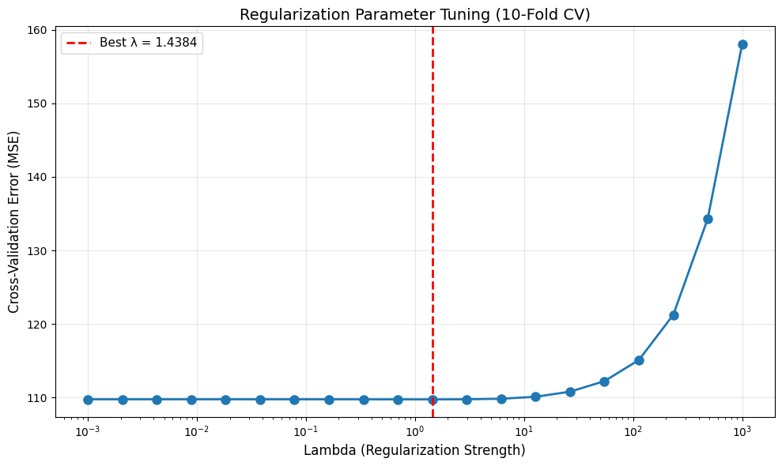
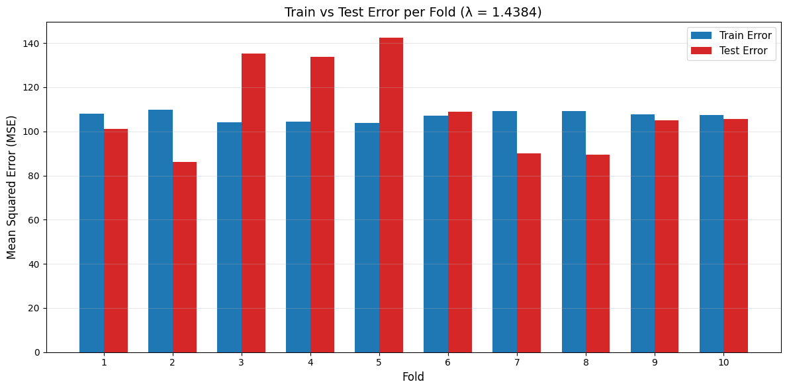
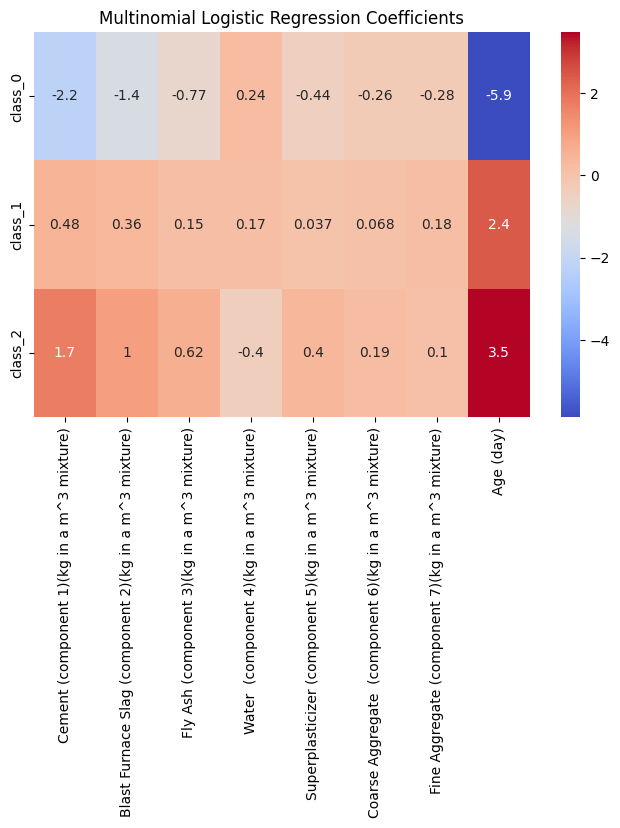
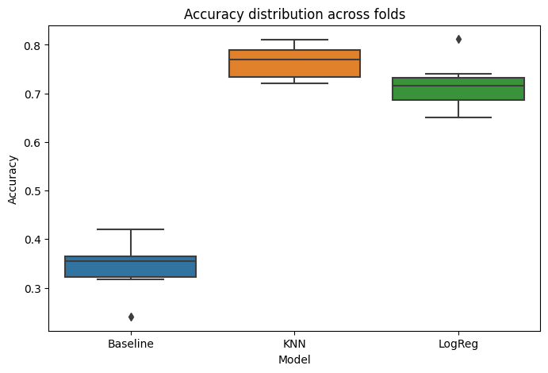

# Concrete Strength: Regression and Classification

This repository contains a 2025 group project from DTU course 02452 Machine
Learning. The project studies the UCI Concrete Compressive Strength dataset
with regression and multi-class classification methods.

The repository is intentionally notebook-based. It presents the original
academic workflow and saved results without turning the work into a larger
Python package.

## Dataset

The public [UCI Concrete Compressive Strength
dataset](https://archive.ics.uci.edu/dataset/165/concrete+compressive+strength)
contains concrete mix measurements and compressive strength in MPa. The eight
input features are:

1. Cement
2. Blast furnace slag
3. Fly ash
4. Water
5. Superplasticizer
6. Coarse aggregate
7. Fine aggregate
8. Age

The dataset is not included in this repository. Its redistribution terms were
not checked as part of this cleanup. Download `Concrete_Data.xls` from UCI and
place it at `data/Concrete_Data.xls`.

## Regression tasks

The first regression notebook studies Ridge Regression. It selects the
regularization parameter from 20 logarithmically spaced lambda values and
interprets the fitted coefficients.

The second regression notebook compares three models:

- a baseline that predicts the training-target mean;
- Ridge Regression;
- an artificial neural network (ANN) with one hidden layer.





## Classification task

The classification notebook converts compressive strength into three classes:

- low: at most 25 MPa;
- medium: above 25 MPa and at most 40 MPa;
- high: above 40 MPa.

It compares multinomial logistic regression, K-nearest neighbors (KNN), and a
majority-class baseline.





## Preprocessing

The input features are standardized before model fitting because their units
and numeric ranges are different. The regression target remains in MPa.

The two regression notebooks use the rows as loaded from the source file. The
classification notebook removes duplicate rows and keeps the last occurrence
before creating the three strength classes. These original notebook choices
have been preserved.

## Model-selection methodology

Ridge Regression uses a logarithmic lambda grid from 0.001 to 1,000. The ANN
uses the original hidden-unit candidates 20, 50, 80, 110, and 140. The
classification notebook uses its original candidate values for logistic
regularization and KNN neighbors.

No folds, candidate values, thresholds, model rankings, or reported metrics
were changed during repository cleanup.

## Nested cross-validation

The regression model comparison uses two-level cross-validation with 10 outer
folds and 10 inner folds. The inner loop selects the Ridge and ANN
hyperparameters. The outer loop estimates generalization error on data that
was not used for selection.

The classification comparison uses 10 outer folds and 5 inner folds. Its inner
loop selects the logistic-regression and KNN hyperparameters, while the outer
loop records model errors, predictions, and accuracies.

## Statistical model comparison

The regression notebook applies the course's correlated t-test (Setup II) to
the outer-fold error differences. The classification notebook uses pairwise
McNemar tests on the saved out-of-fold predictions.

## Confirmed results

The final report gives the following mean outer-fold regression errors:

| Model | Mean MSE |
| --- | ---: |
| ANN | 26.64 |
| Ridge Regression | 109.83 |
| Baseline | 279.13 |

The report states that all pairwise regression differences were statistically
significant under the correlated t-tests.

For classification, the reported ranking is:

1. KNN
2. Multinomial logistic regression
3. Baseline

The report states that the pairwise McNemar tests found all differences
statistically significant.

These are preserved results from the report and notebook outputs. The models
were not retrained during repository cleanup.

## Repository structure

```text
.
|-- README.md
|-- requirements.txt
|-- .gitignore
|-- notebooks/
|   |-- 01_ridge_regression.ipynb
|   |-- 02_regression_model_comparison.ipynb
|   `-- 03_classification.ipynb
|-- report/
|   `-- project_report.pdf
`-- assets/
    `-- figures/
        |-- classification_accuracy_comparison.png
        |-- logistic_regression_coefficients.png
        |-- ridge_lambda_cv.png
        `-- ridge_train_test_mse.png
```

## Installation

Create and activate a virtual environment, then install the notebook
dependencies:

```bash
python -m venv .venv
python -m pip install -r requirements.txt
```

Use these notebooks in JupyterLab, Jupyter Notebook, VS Code, or another
compatible notebook environment.

## Usage

1. Download `Concrete_Data.xls` from the UCI dataset page.
2. Create a `data/` directory in the repository root.
3. Place the file at `data/Concrete_Data.xls`.
4. Start your notebook environment from the `notebooks/` directory.
5. Run each notebook from top to bottom.

The regression comparison keeps its outer-fold results in memory. It does not
require the previously referenced `regression_comparison_errors.csv` file.

## Limitations

- The dataset is not committed, so full notebook execution was not performed
  during cleanup.
- The saved ANN run includes convergence warnings for some fits at the original
  `max_iter=3000` setting.
- Some cross-validation splitters in the classification notebook do not define
  a random seed. A fresh run can therefore produce different fold assignments.
- The notebooks preserve the original course methodology, including their
  preprocessing and fold design. They have not been rewritten as
  production-grade training pipelines.
- The figures in `assets/figures/` were extracted from existing notebook
  outputs; they were not recreated with new data or fabricated values.

## Academic attribution

This was a DTU group project for 02452 Machine Learning. The final report
credits:

- Ecenaz Elverdi
- Burak Yenidzhe
- Yusuf Eren Kılıç

The notebooks and report represent group work. They should not be interpreted
as work completed by one person alone.

## Individual contribution

This was a group project. My primary contribution was the regression
model-comparison section, including comparison of the baseline, Ridge
Regression and ANN models, two-level cross-validation, hyperparameter
selection and correlated statistical testing.

Classification is presented here as a group-project component.
